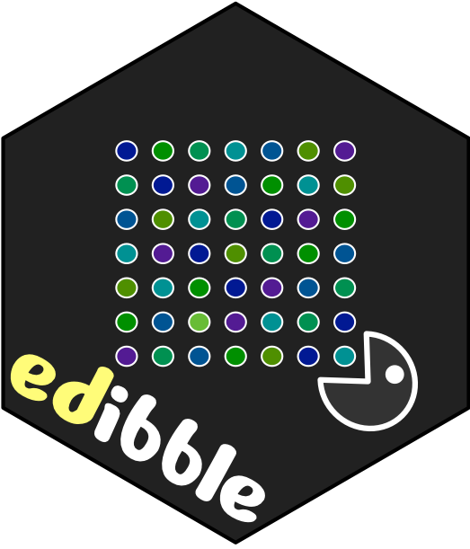

<!-- README.md is generated from README.Rmd. Please edit that file -->

```{r, include = FALSE}
knitr::opts_chunk$set(
  collapse = TRUE,
  comment = "#>",
  fig.path = "man/figures/README-"
)
```
# edibble  

<!-- badges: start -->
[](https://www.tidyverse.org/lifecycle/#experimental)
<!-- badges: end -->

## Installation

Install the development version with: 

```
# install.packages("remotes")
remotes::install_github("emitanaka/edibble")
```


## Overview

Software for constructing experimental design generally utilise: (1) functions that are specific for creating particular experimental designs (e.g. `agricolae::design.lsd()` creates a Latin Square Design) or (2) where it is general, requires an input (usually a data frame) with the initial experimental design structure (e.g. `AlgDesign::optBlock()` or most optimal designs). Both of these approaches assume that the user is well acquainted with the experimental structure and objective, but in practice these are the greatest bottleneck before even getting to think about the randomisation process. 

💡 The big idea with the edibble R-package is that you specify an experimental design by being more expressive about the experiment. The edibble code for constructing experimental design should evoke a rough idea about the experimental layout even to a layperson. 

🎯 The grand goal for the edibble project is to define the _grammar of experimental design_ and implement it. 

Take for an example, the classic split-plot design that contains 4 wholeplots with 4 sub plots within each wholeplot (so 16 subplots in total). There are 2 treatment factors: fertilizer (with levels A and B) and variety (with levels V1 and V2). Each level of the fertilizer is randomly applied to two wholeplots. Each level of variety is randomly applied to two subplots within each wholeplot. 

In edibble, we can code the above split-plot design as below. You can see it outputs a data frame (or tibble) called edibble. The name origin of `edibble` is a play on [`tibble`](https://tibble.tidyverse.org/) and can be thought of as tibble output for experimental design.

```{r split-plot}
library(edibble)

set.seed(2020) # 🔥🦠🏠😱

spdes <- start_design("Split-plot Design") %>% 
  set_units(wholeplot = 4,
            subplot = nested_in(wholeplot, 4)) %>% 
  set_trts(fertilizer = c("A", "B"),
           variety    = c("V1", "V2")) %>% 
  allocate_trts(fertilizer ~ wholeplot, 
                   variety ~ subplot) %>% 
  randomise_trts()
```

Above object contains the intermediate construct of an experimental design (called `edbl_graph`). When you are ready to serve your design, you can get the table output (called `edbl_table`) by using `serve_table` as below.

```{r split-plot-table}
serve_table(spdes)
```

Once you get the rough idea of how edibble specifies design, you should be roughly be able to visualise what the experimental design layout is just from looking at the code alone. Take another example below. Can you see what the design is?

```{r rcbd, fig.height = 5, fig.width = 5}
rcbd <- start_design("RCBD") %>% 
  set_units(block = 4,
            plot  = nested_in(block, 4)) %>% 
  set_trts(fertilizer = c("A", "B"),
           variety    = c("V1", "V2")) %>% 
  allocate_trts(fertilizer:variety ~ plot) %>% 
  randomise_trts()
```

The above design is an example of a Randomised Complete Block Design. If you change the unit names from `block` to `wholeplot` and `plot` to `subplot`, it looks like the Split-plot Design, so what differs here aside from the unit names? Yes, the allocation of treatment is more restrictive in the Split-plot Design. This is one of the key benefits of using edibble to construct your experimental design; it makes you think about your experiment in bare terms.

If you have trouble understanding the layout, there are a number of considerations that are designed to help you to form a better understanding of what you have specified. I outline just a couple here with more details and explanations to come (writing takes a lot of time...).

You can see a high-level overview of the variables and its relation by using `plot` on the intermediate construct of the design.

```{r high-view, fig.height = 6, fig.width = 12}
par(mfrow = c(1, 2))
plot(rcbd)
plot(spdes)
```

If you want to see the connections in terms of the actual units, then you can change the view to a low-level view. 

```{r low-view, fig.height = 6, fig.width = 12}
par(mfrow = c(1, 2))
plot(rcbd, view = "low")
plot(spdes, view = "low")
```

The low-level view is often a bit cluttered so you may like to use the interactive version as below instead. 

```{r, eval = FALSE}
iplot(rcbd)
```

⚠️ Please note that edibble is currently fragile. That means that the code is likely to break when you deviate from example code. Even it it works, you should diagnose the output to make sure it did what you expected.

## Named experimental designs

While named experimental designs can be muddling to understanding the experimental structure, it is still convenient to be able to concisely describe common structures. I take a compromising approach where named experimental designs can be generated concisely using the `make_classical` function. The output contains information about the design, the code to generate the design using edibble that can be easily copy-and-pasted and the output data frame. If you want the edibble code alone then you can just use `code_classical`.

```{r}
make_classical("crd", n = 30, t = 5)

code_classical("rcbd", t = 4, n = 40)
```

The terminal output has color. You can see the terminal output below for the Split-plot design.

```{r, include = FALSE}
options(cli.num_colors = 256L)
options(asciicast_knitr_svg = TRUE)
asciicast::init_knitr_engine(
  startup = quote({
      library(edibble)
    }),
  echo = TRUE,
  echo_input = FALSE)
```


```{asciicast split-plot-print}
make_classical("split", t1 = 4, t2  = 2, r = 4)
```

## Context of the experiment

In designing an experiment, there may be certain context of the experiment that are important but aren't utilised in the design of the experiment. You can add notes about the experiment in the `set_context()`. 

These are shown when you print your intermediate construct of the design to remind you about some context of the experiment. I think these steps are important since you may come to realise later some of the context may need to be properly accounted for in the design later, or if there are unexpected results in the experiment, these notes may aid you in uncovering some unexpected sources of variation. For longer form contexts, it's better to write them to an external file and you can write the name of the file in context.

The idea here is that the user is reminded about the experimental context but also these contexts can also be exported out together with the design table. Many experimental design software assume that the user knows what experimental design to implement from the get-go, but in practice there may be a lot of back-and-forth with the domain experts or others involved in the experiment. edibble tries to aid in the whole workflow and not just the design generation process.

```{asciicast exp-context}
des <- start_design("COVID-19") %>%
  set_context(question = "Is the vaccine effective?",
              where = "Tested in the lab",
              "experiment is blinded",
              "experiment is carried out by one technician",
              "More details are in {.file experimental-details.txt}.") %>% 
  set_units(rat = 20) %>% 
  set_trts(treat = c("A", "B")) 
des
```

You can muffle these messages by using `suppress_context`. [TODO: add option to muffle these and shorten some long contexts.]

```{r, include = FALSE}
options(crayon.enabled = FALSE)
```

```{r exp-context, include = FALSE}
```

```{r}
suppress_context(des)
```

## Recording responses and other variables

Now you can write out what you plan to record for the experiment with `record_vars`. The record should be made on a unit defined in `set_units`. You can add data validation rules 
with `expect_vars` which is used when the data are exported. This means that data entry is restricted according to the rules you specify.

```{r}
des <-
  start_design(name = "Effective teaching") %>%
    set_units(class = 4,
              student = nested_in(class, 30)) %>%
    set_trts(style = c("flipped", "traditional"),
             exam = c("take-home", "open-book", "closed-book")) %>%
    allocate_trts(style ~ class,
                  exam ~ student) %>%
    randomise_trts() %>%
    record_vars(student = c(exam_mark,
                            quiz1_mark,
                            quiz2_mark,
                            gender),
                 class = c(room,
                           teacher)) %>%
    expect_vars( exam_mark = to_be_numeric(with_value(between = c(0, 100))),
                quiz1_mark = to_be_integer(with_value(between = c(0, 15))),
                quiz2_mark = to_be_integer(with_value(between = c(0, 30))),
                    gender = to_be_factor(levels = c("female", "male", "non-binary")),
                   teacher = to_be_character(length = with_value("<=", 100)),
                      room = to_be_character(length = with_value(">=", 1)))

serve_table(des)
```

```{r, eval = FALSE}
export_design(des, "/PATH/TO/FILE.xlsx")
```

Now you have an excel file that separates out observational units to their 
own sheet and data entering is now restricted to what you set out in `expect_vars`. 

```{r, echo = FALSE}
knitr::include_graphics("man/figures/README-export.png")
```


## Related Work

The way that edibble specifies experimental design is largely novel (if I say so myself) and there are no work that resembles it. I'm concurrently working on two extension packages:

* `deggust` - to visualise the designs constructed from edibble as ggplot2 objects (WIP). 
* `sizzle` - for experiments that require sample size calculation (WIP).


Below are some other related work. You can also have a look at the [CRAN Task View for Design of Experiment and Analysis of Experimental Data](https://cran.r-project.org/web/views/ExperimentalDesign.html) for a whole collection. 

* `DeclareDesign` for survey or sampling designs
* `designr` for balanced factorial designs with crossed and nested random and fixed effect to data frame
* `dae` for functions useful in the design and ANOVA of experiments (this is in fact powering the randomisation in edibble)
* `plotdesignr` for designing agronomic field experiments

## Code of Conduct

Please note that the edibble project is released with a [Contributor Code of Conduct](https://contributor-covenant.org/version/2/0/CODE_OF_CONDUCT.html).
By contributing to this project, you agree to abide by its terms.
