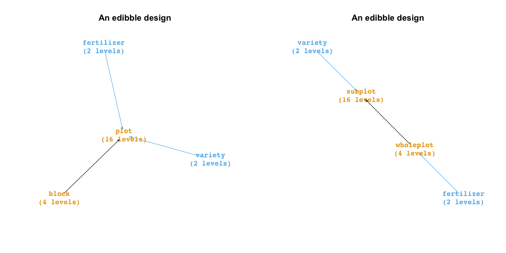
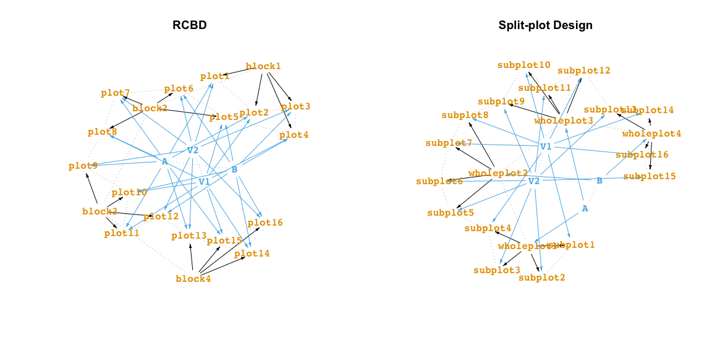
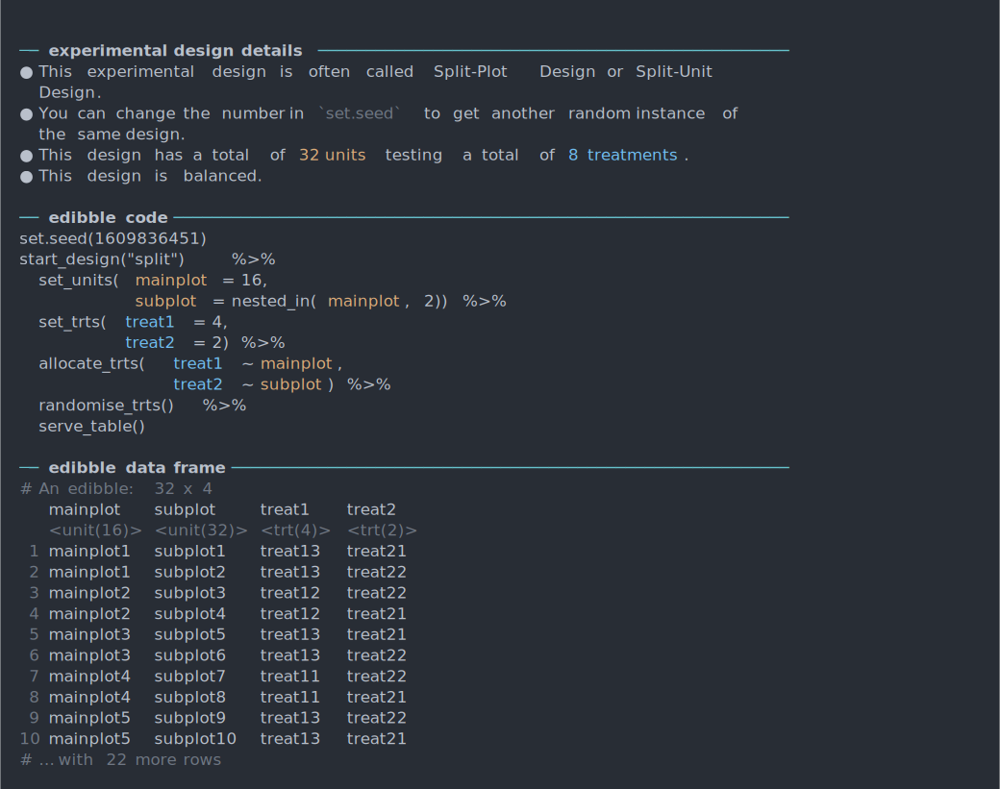
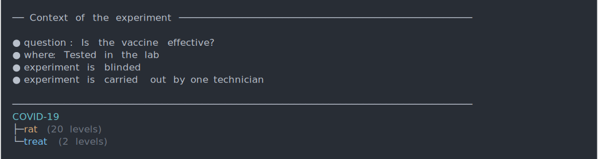

<!-- README.md is generated from README.Rmd. Please edit that file -->

# edibble 

<!-- badges: start -->

[](https://www.tidyverse.org/lifecycle/#experimental)
<!-- badges: end -->

## Installation

Install the development version with:

    # install.packages("remotes")
    remotes::install_github("emitanaka/edibble")

## Overview

Software for constructing experimental design generally utilise: (1)
functions that are specific for creating particular experimental designs
(e.g. `agricolae::design.lsd()` creates a Latin Square Design) or (2)
where it is general, requires an input (usually a data frame) with the
initial experimental design structure (e.g. `AlgDesign::optBlock()` or
most optimal designs). Both of these approaches assume that the user is
well acquainted with the experimental structure and objective, but in
practice these are the greatest bottleneck before even getting to think
about the randomisation process.

💡 The big idea with the edibble R-package is that you specify an
experimental design by being more expressive about the experiment. The
edibble code for constructing experimental design should evoke a rough
idea about the experimental layout even to a layperson.

🎯 The grand goal for the edibble project is to define the *grammar of
experimental design* and implement it.

Take for an example, the classic split-plot design that contains 4
wholeplots with 4 sub plots within each wholeplot (so 16 subplots in
total). There are 2 treatment factors: fertilizer (with levels A and B)
and variety (with levels V1 and V2). Each level of the fertilizer is
randomly applied to two wholeplots. Each level of variety is randomly
applied to two subplots within each wholeplot.

In edibble, we can code the above split-plot design as below. You can
see it outputs a data frame (or tibble) called edibble. The name origin
of `edibble` is a play on [`tibble`](https://tibble.tidyverse.org/) and
can be thought of as tibble output for experimental design.

``` r
library(edibble)

set.seed(2020) # 🔥🦠🏠😱

spdes <- start_design("Split-plot Design") %>% 
  set_units(wholeplot = 4,
            subplot = nested_in(wholeplot, 4)) %>% 
  set_trts(fertilizer = c("A", "B"),
           variety    = c("V1", "V2")) %>% 
  allocate_trts(fertilizer ~ wholeplot, 
                   variety ~ subplot) %>% 
  randomise_trts()
```

Above object contains the intermediate construct of an experimental
design (called `edbl_nexus`). When you are ready to serve your design,
you can get the table output (called `edbl_df`) by using `serve_table`
as below.

``` r
serve_table(spdes)
#> # An edibble: 16 x 4
#>    wholeplot  subplot    fertilizer variety 
#>    <unit(4)>  <unit(16)> <trt(2)>   <trt(2)>
#>  1 wholeplot1 subplot1   A          V2      
#>  2 wholeplot1 subplot2   A          V2      
#>  3 wholeplot1 subplot3   A          V1      
#>  4 wholeplot1 subplot4   A          V1      
#>  5 wholeplot2 subplot5   B          V2      
#>  6 wholeplot2 subplot6   B          V1      
#>  7 wholeplot2 subplot7   B          V1      
#>  8 wholeplot2 subplot8   B          V2      
#>  9 wholeplot3 subplot9   A          V1      
#> 10 wholeplot3 subplot10  A          V2      
#> 11 wholeplot3 subplot11  A          V2      
#> 12 wholeplot3 subplot12  A          V1      
#> 13 wholeplot4 subplot13  B          V1      
#> 14 wholeplot4 subplot14  B          V2      
#> 15 wholeplot4 subplot15  B          V1      
#> 16 wholeplot4 subplot16  B          V2
```

Once you get the rough idea of how edibble specifies design, you should
be roughly be able to visualise what the experimental design layout is
just from looking at the code alone. Take another example below. Can you
see what the design is?

``` r
rcbd <- start_design("RCBD") %>% 
  set_units(block = 4,
            plot  = nested_in(block, 4)) %>% 
  set_trts(fertilizer = c("A", "B"),
           variety    = c("V1", "V2")) %>% 
  allocate_trts(fertilizer:variety ~ plot) %>% 
  randomise_trts()
```

The above design is an example of a Randomised Complete Block Design. If
you change the unit names from `block` to `wholeplot` and `plot` to
`subplot`, it looks like the Split-plot Design, so what differs here
aside from the unit names? Yes, the allocation of treatment is more
restrictive in the Split-plot Design. This is one of the key benefits of
using edibble to construct your experimental design; it makes you think
about your experiment in bare terms.

If you have trouble understanding the layout, there are a number of
considerations that are designed to help you to form a better
understanding of what you have specified. I outline just a couple here
with more details and explanations to come (writing takes a lot of
time…).

You can see a high-level overview of the variables and its relation by
using `plot` on the intermediate construct of the design.

``` r
par(mfrow = c(1, 2))
plot(rcbd)
plot(spdes)
```

<!-- -->

If you want to see the connections in terms of the actual units, then
you can change the view to a low-level view.

``` r
par(mfrow = c(1, 2))
plot(rcbd, view = "low")
plot(spdes, view = "low")
```

<!-- -->

The low-level view is often a bit cluttered so you may like to use the
interactive version as below instead.

``` r
subset_levels(rcbd$graph) %>% 
  igraph::tkplot()
```

⚠️ Please note that edibble is currently fragile. That means that the
code is likely to break when you deviate from example code. Even it it
works, you should diagnose the output to make sure it did what you
expected.

## Named experimental designs

While named experimental designs can be muddling to understanding the
experimental structure, it is still convenient to be able to concisely
describe common structures. I take a compromising approach where named
experimental designs can be generated concisely using the
`make_classical` function. The output contains information about the
design, the code to generate the design using edibble that can be easily
copy-and-pasted and the output data frame. If you want the edibble code
alone then you can just use `code_classical`.

``` r
make_classical("crd", n = 30, t = 5)
#> 
#> ── experimental design details ─────────────────────────────────────────────────
#> ● This experimental design is often called Completely Randomised Design.
#> ● You can change the number in `set.seed` to get another random instance of
#>   the same design.
#> ● This design has a total of 30 units testing a total of 5 treatments.
#> The following information is only true for the chosen parameters and not
#> necessary true for all Completely Randomised Designs.
#>   ◯ This design is balanced for the given numbers.
#> 
#>   ── edibble code ────────────────────────────────────────────────────────────────
#> set.seed(1609836270)
#> start_design("crd") %>%
#>   set_units(unit = 30) %>%
#>   set_trts(treat = 5) %>%
#>   allocate_trts(treat ~ unit) %>%
#>   randomise_trts() %>%
#>   serve_table()
#> 
#>   ── edibble data frame ──────────────────────────────────────────────────────────
#> # An edibble: 30 x 2
#>    unit       treat   
#>    <unit(30)> <trt(5)>
#>  1 unit1      treat1  
#>  2 unit2      treat3  
#>  3 unit3      treat1  
#>  4 unit4      treat2  
#>  5 unit5      treat4  
#>  6 unit6      treat2  
#>  7 unit7      treat2  
#>  8 unit8      treat4  
#>  9 unit9      treat2  
#> 10 unit10     treat1  
#> # … with 20 more rows

code_classical("rcbd", t = 4, n = 40)
#> set.seed(1609836270)
#> start_design("rcbd") %>%
#>   set_units(block = 7,
#>             unit = nested_in(block, 4)) %>%
#>   set_trts(treat = 4) %>%
#>   allocate_trts(treat ~ unit) %>%
#>   randomise_trts() %>%
#>   serve_table()
```

The terminal output has color. You can see the terminal output below for
the Split-plot design.

``` asciicast
make_classical("split", t1 = 4, t2  = 2, r = 4)
```

<!-- -->

## Context of the experiment

In designing an experiment, there may be certain context of the
experiment that are important but aren’t utilised in the design of the
experiment. You can add notes about the experiment in the
`add_context()`.

These are shown when you print your intermediate construct of the design
to remind you about some context of the experiment. I think these steps
are important since you may come to realise later some of the context
may need to be properly accounted for in the design later, or if there
are unexpected results in the experiment, these notes may aid you in
uncovering some unexpected sources of variation.

``` asciicast
des <- start_design("COVID-19") %>%
  add_context(question = "Is the vaccine effective?",
              where = "Tested in the lab",
              "experiment is blinded",
              "experiment is carried out by one technician") %>% 
  set_units(rat = 20) %>% 
  set_trts(treat = c("A", "B")) 
des
```

<!-- -->

You can muffle these messages by using `suppress_context`. \[TODO: add
option to muffle these and shorten some long contexts.\]

``` r
suppress_context(des)
#> COVID-19
#> ├─rat (20 levels)
#> └─treat (2 levels)
```

## Related Work

The way that edibble specifies experimental design is largely novel (if
I say so myself) and there are no work that resembles it. I’m
concurrently working on two extension packages:

  - `deggust` - to visualise the designs constructed from edibble as
    ggplot2 objects (WIP).
  - `sizzle` - for experiments that require sample size calculation
    (WIP).

Below are some other related work. You can also have a look at the [CRAN
Task View for Design of Experiment and Analysis of Experimental
Data](https://cran.r-project.org/web/views/ExperimentalDesign.html) for
a whole collection.

  - `DeclareDesign` for survey or sampling designs
  - `designr` for balanced factorial designs with crossed and nested
    random and fixed effect to data frame
  - `dae` for functions useful in the design and ANOVA of experiments
    (this is in fact powering the randomisation in edibble)
  - `plotdesignr` for designing agronomic field experiments

## Code of Conduct

Please note that the edibble project is released with a [Contributor
Code of
Conduct](https://contributor-covenant.org/version/2/0/CODE_OF_CONDUCT.html).
By contributing to this project, you agree to abide by its terms.
