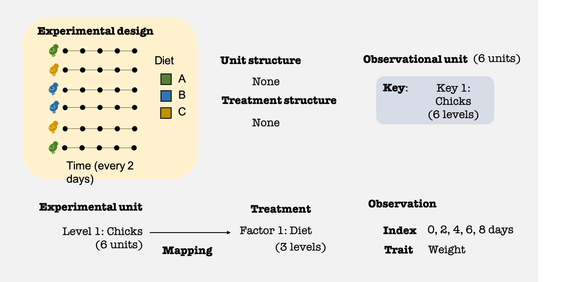

<!-- README.md is generated from README.Rmd. Please edit that file -->

# edibble

<!-- badges: start -->

[](https://www.tidyverse.org/lifecycle/#experimental)
<!-- badges: end -->

The main aims of `edibble` R-package are:

1.  facilitate statistical thinking of adapting experimental designs to
    different conditions by implementing the **grammar of experimental
    design** to generate new designs, and
2.  lubricate the project flow of generating experimental data.

The name origin of `edibble` is a play on `tibble` (a modern take on
data frames) with motivation as `tibble` for experimental design.

The grammatical expressions to generate design can draw parallel to
`dplyr` so some functions may be decoupled to a package called `edplyr`
🤔

## Experimental data

The focus of `tidyverse` R-package is well suited for the data science
project workflow as illustrated below in (B) (from [Grolemund and
Wickham 2017](https://r4ds.had.co.nz/introduction.html)). For
experimental data, statististical project begin before obtaining data as
depicted below in (A). The focus of `edibble` is to facilitate work in
(A).


## Statistical thinking

The central idea of the *grammar of experimental design* can be
illustrated by drawing analogy to the (layered) grammar of graphics
implemented in `ggplot2`.

Grammar of graphics defines independent graphical components that make
possible to graph complex plots and make it extensible. For example, in
figure (B) below, a stacked barplot is transformed to a pie chart by
transforming the coordinate system from Cartersian to polar coordinates.
The corresponding functions to generate these figures in `base` R are
`barplot` and `pie`. These singular purpose graphic functions can only
generate the corresponding “named plots”. Hence why `ggplot2` is
powerful as the functions are no longer limiting the creation of
different plots.

In experimental design, `agricolae` is by far the most popular R package
on the CRAN task view of experimental design. Just as there are “named
plots”, there are “named experimental designs”. E.g. completely
randomised design (CRD), randomised complete block design (CRBD),
balanced incomplete block design (BIBD) and so on. The functions to
generate designs in `agricolae` are motivated by these named designs
(e.g. `design.crd()` and `design.rcbd()`). These functions are limiting
the adaptation of experimental designs to different conditions in a
similar manner to the `base` plots. Figure (A) below shows how CRD is
tranformed to RCBD by imposing a blocking structure on the units
(provided the units and treatment number are conformable).


Below are connections between different named experimental designs.


Below show examples where the **elements of experimental designs** are
identified.





## Project Flow

  - `edibble` will integrate an easy way to export the design in a
    rectangular tabular format so there is a smooth translation from the
    generation of experimental design to data collection.

  - `edibble` will allow easy visualisation of experimental designs that
    serve as a communication medium in a number scenarios. For example,
    an easy way to visualise the experimental design would ensure that
    all parties involved can digest the design quickly and correct any
    mistake as needed before conducting the experiment.

## API Prototype

The core elements of experimental design are `trts` and `units`.
Specifications of more complex designs include:

  - `phase` for multi-phase designs;
  - `index` for temporal components (default value `0`);
  - `keys` that uniquely identify observational units;
  - `map` define mapping structures;
  - `traits` for observations;
  - `strata` for nested designs; (questioning this)
  - `block` and `cluster` are synonyms for grouped units.

These are manipulated by the *verb* that precedes these elements
separated by `_`. Some verbs include `set`, `get`, `group`, `modify`,
`split`, `cross`, `combine`, `apply`, `assign`, `randomise`, `measure`,
`allocate`, `permute`, `cluster`.

``` r
design <- edibble() %>% 
  # [    ]
  set_trts(A = 1:3, B = c("X", "Y")) %>% 
  # [ T1: A:{1 2 3}  ]
  # [ T2: B:{X Y}    
  set_units(18) %>% 
  # [ T1: A:{1 2 3}  ]
  # [ T2: B:{X Y}    ]
  # [ U1: 1, ..., 18                ]
  group_units(size = 3) %>% 
  # [ T1: A:{1 2 3}  ]
  # [ T2: B:{X Y}    ]
  # [ U1: 1, ..., 18                ]
  # [ U2: [1,2,3], [4,5,6],...,[16,17,18]]
  randomise_map(.U1 ~ .T1,
                .U2 ~ .T2) 
  # [ T1: A:{1 2 3}  ]
  # [ T2: B:{X Y}    ]
  # [ U1: 1, ..., 18                ]
  # [ U2: [1,2,3], [4,5,6],...,[16,17,18]]
  # U1 -> T1 [random]
  # U2 -> T2 [random]
```

The end result of this will be a modified `tibble` (built from
`pillar`). It will include summary of treatments and units. The plan is
also to have the number of levels of factors printed as well.

As under the hood, `edibble` output is a data frame, it is easy to
export the output to a spreadsheet using standard exporting tools for
data frames. While this seems such a small issue, this is important for
lubricating the generation of experimental design to data collection.
Ultimately the person collecting the data should aim to add extra
column(s) for the observed data to the `edibble` output.

The `edibble` output can also be used to quickly generate a sketch of
the design by adding one extra function in the pipeline. E.g.

``` r
design %>% visualise_design()
```

Using a similar mechanism to `lazy_dt` in `dtplyr`, `edibble` should
also be able to *animate* the steps required to generate the design.
This will make it useful for presentations or general communication to
ensure all parties involved in the generation of experimental design are
all on the same page.

``` r
design %>% animate_design()
```

These functions are designed to visualise experimental design *fast*.
Some more fine tuning can be provided so that users can customise the
visualisation outputs for publications or reports. E.g.
`modify_trts(.T1, images = c("drugA.jpg", "drugB.jpg")` to modify from
standard circle units to user supplied images.

\*Note this API prototype code is still experimental and bound to
change.

## Installation

Currently the package is not available for
installation.

<!-- And the development version from [GitHub](https://github.com/) with: -->

<!-- ``` r -->

<!-- # install.packages("devtools") -->

<!-- devtools::install_github("emitanaka/edibble") -->

<!-- ``` -->

## Related Work

  - `DeclareDesign` although motivation is different to `edibble`.

## Acknowlegement

Thanks to Francis Hui, Di Cook, Rob Hyndman and Nick Tierney for their
feedback on the proposed idea.
