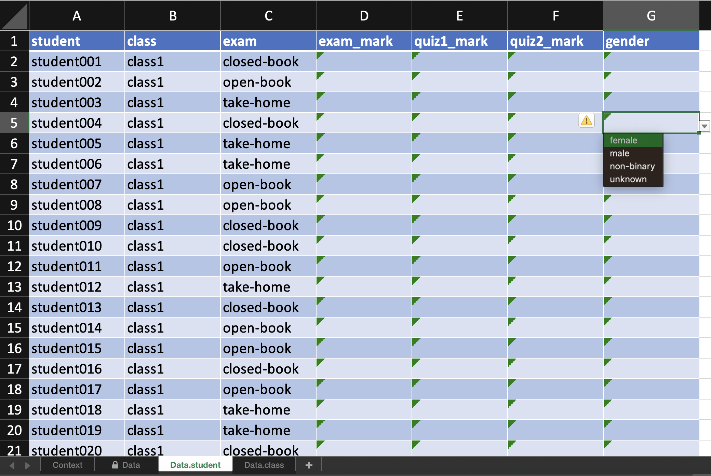
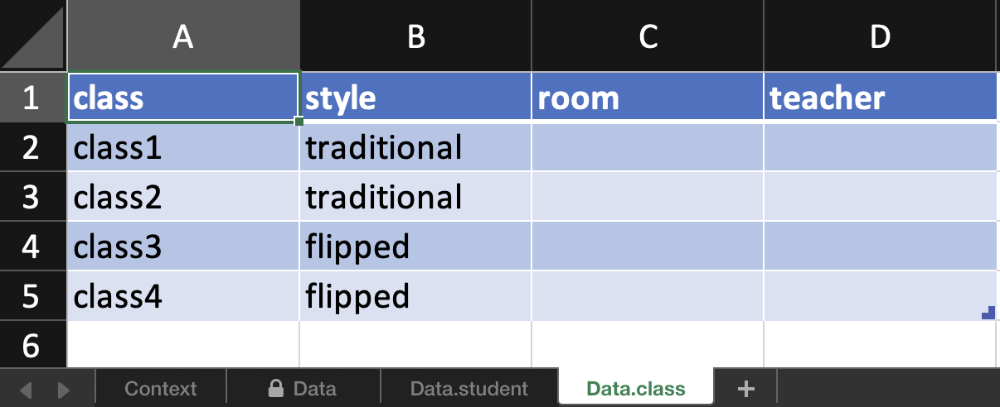

<!-- README.md is generated from README.Rmd. Please edit that file -->

# edibble 

<!-- badges: start -->

[](https://www.tidyverse.org/lifecycle/#experimental)
<!-- badges: end -->

## Installation

Install the development version with:

    # install.packages("remotes")
    remotes::install_github("emitanaka/edibble")

## Overview

There are two intermixing goals for edibble:

  - defining the **grammar of experimental design**, and
  - provide an R-package that aids in the workflow of constructing an
    experimental design and serves as an implementation of the so-called
    grammar of experimental design.

The self-proclaimed *grammar of experimental design* attempts to define
rules and structures that govern the specification of an experimental
design. Some (work-in-progress) details can be found in
`vignette("grammar")` where it is serving as the dumping ground of my
thoughts for now. The use of the word “grammar” pay homage to the
[*grammar of graphics*](https://ggplot2.tidyverse.org/) and [*grammar of
data manipulation*](https://dplyr.tidyverse.org/) which this work is
heavily inspired from.

### Experimental data

tidyverse is well suited for the data science project workflow as
illustrated below in (B) (from [Grolemund and
Wickham 2017](https://r4ds.had.co.nz/introduction.html)). For
experimental data, the statistical aspect begins before obtaining data
as depicted below in (A). The focus of `edibble` is to facilitate work
in (A).


The edibble R-package differ considerably to other packages for
constructing experimental design with a focus on the whole process and
less on the randomisation process (which the other software generally
focus and do well on). Some features include:

  - declaratively create experimental designs based on experimental
    components (e.g. units and treatments),
  - explicitly specify variables that are to be recorded
    (e.g. response), and
  - set expected values for variables to be recorded which restrict the
    data entry when the design is exported as an xlsx file,
  - plot and print outputs for intermediate constructs of the
    experimental design with configurations for most graphical elements
    (see `vignette("output")`),
  - make classical named designs (see `vignette("named-designs")`),
  - add context that also serves as notes about experiment (see
    `vignette("edibble")`).

## Designing the *whole* experiment

An experiment is likely to involve a number of people. For simplicity,
let’s suppose there are three actors (we’ll use the pronoun them/they
for each actor):

  - the **domain expert** 🕵️‍♀️ drives the experimental objective and
    has the intricate knowledge about the subject area,
  - the **statistician** 👩🏻‍💻 creates the design layout that contains
    the treatment-to-unit allocations after taking into account the
    statistical and practical constraints,
  - the **technician** 👨‍🔬 carries out the experiment and collects the
    data.

The actors are purely illustrative. In practice, multiple people can
take on each role, one person can take on multiple roles, and/or a
person in the role may not specialise in that role (i.e. a statistician
role can be acted out by a non-statistician).

An experiment may begin with no data at all. The **domain expert** comes
up with the experimental hypothesis or question and recruit a
**statistician** to help design the experiment. Before a
**statistician** can produce the design layout, they must converse with
the **domain expert** to understand the experimental objective,
resources, practical constraints and other possible nuances that might
influence the outcome of the experiment. This *consultation phase* an
important information collection.

With **edibble**, the functions resemble a natural language that you may
have in a consultation phase. You may take notes of context using
`set_context()`; you write down what and how many units and treatments
you have available using `set_units()` and `set_trts()`; you enquire
about if there are any restrictions in allocation of treatments and set
them using `allocate_trts()`; you may ask what responses are measured or
what records will be kept and set them using `set_rcrds()`; you can
solicit expected values for these records and encode them using
`expect_rcrds()`. The last point is important to minimise the error in
the data entry process. If the **technician** enters an invalid entry,
then an error is produced. This concept is illustrated below using a UML
sequence diagram.


## Examples

Consider an experiment where you want to know what is an effective way
of teaching (flipped or traditional style) for teaching a particular
subject and how different forms of exams (take-home, open-book or
closed-book) affect student’s marks.

There are four classes for this subject with each class holding 30
students. The teaching style can only be applied to the whole class but
exam can be different for individual students.

``` r
library(edibble)

set.seed(2020)

des <- start_design(name = "Effective teaching") %>%
    set_units(class = 4,
              student = nested_in(class, 30)) %>%
    set_trts(style = c("flipped", "traditional"),
             exam = c("take-home", "open-book", "closed-book")) %>%
    allocate_trts(style ~ class,
                  exam ~ student) %>%
    randomise_trts()

serve_table(des)
#> # An edibble: 120 x 4
#>        class     student       style        exam
#>    <unit(4)> <unit(120)>    <trt(2)>    <trt(3)>
#>  1    class1   student1  traditional take-home  
#>  2    class1   student2  traditional take-home  
#>  3    class1   student3  traditional open-book  
#>  4    class1   student4  traditional take-home  
#>  5    class1   student5  traditional closed-book
#>  6    class1   student6  traditional closed-book
#>  7    class1   student7  traditional closed-book
#>  8    class1   student8  traditional open-book  
#>  9    class1   student9  traditional take-home  
#> 10    class1   student10 traditional take-home  
#> # … with 110 more rows
```

Before constructing the experiment, you might want to think about what
you are recording for which level of unit and what values these
variables can be recorded as.

``` r
out <- des %>% 
    set_rcrds(student = c(exam_mark,
                          quiz1_mark,
                          quiz2_mark,
                          gender),
              class = c(room,
                        teacher)) %>%
    expect_rcrds(exam_mark = to_be_numeric(with_value(between = c(0, 100))),
                quiz1_mark = to_be_integer(with_value(between = c(0, 15))),
                quiz2_mark = to_be_integer(with_value(between = c(0, 30))),
                    gender = to_be_factor(levels = c("female", "male", "non-binary", "unknown")),
                   teacher = to_be_character(length = with_value("<=", 100)),
                      room = to_be_character(length = with_value(">=", 1))) %>% 
  serve_table()

out
#> # An edibble: 120 x 10
#>          class     student      style       exam exam_mark quiz1_mark quiz2_mark
#>      <unit(4)> <unit(120)>   <trt(2)>   <trt(3)>    <rcrd>     <rcrd>     <rcrd>
#>  1      class1   student1  tradition… take-home…         ■          ■          ■
#>  2      class1   student2  tradition… take-home…         ■          ■          ■
#>  3      class1   student3  tradition… open-book…         ■          ■          ■
#>  4      class1   student4  tradition… take-home…         ■          ■          ■
#>  5      class1   student5  tradition… closed-bo…         ■          ■          ■
#>  6      class1   student6  tradition… closed-bo…         ■          ■          ■
#>  7      class1   student7  tradition… closed-bo…         ■          ■          ■
#>  8      class1   student8  tradition… open-book…         ■          ■          ■
#>  9      class1   student9  tradition… take-home…         ■          ■          ■
#> 10      class1   student10 tradition… take-home…         ■          ■          ■
#> # … with 110 more rows, and 3 more variables: gender <rcrd>, room <rcrd>,
#> #   teacher <rcrd>
```

When you export the above edibble design using the `export_design`
function, the variables you are recording are constraint to the values
you expect, e.g. for factors, the cells have a drop-down menu to select
from possible values.

``` r
export_design(out, file = "/PATH/TO/FILE.xlsx")
```



In addition, there is a spreadsheet for every observational level. E.g.
here `room` and `teacher` is the same for all students in one class so
rather than entering duplicate information, these are exported to
another sheet for data entry.



There is also support for more complex nesting structures however
randomisation is yet to be supported for this. You can always make the
structure using edibble and take the resulting data frame to use in
other experimental design software. It’s also possible to bring existing
data frame into edibble if you want to take advantage of the exporting
feature in edibble.

``` r
start_design("nesting structure") %>% 
  # there are 3 sites labelled A, B, C
  set_units(site = c("A", "B", "C"),
            # each site has 2 blocks except B with 3 sites
            block = nested_in(site, 
                              "B" ~ 3,
                                . ~ 2),
            # levels can be specified by their number instead
            # so for below "block1" has 30 plots, 
            # "block2" and "block3" has 40 plots,
            # the rest of blocks have 20 plots.
            plot = nested_in(block, 
                              1 ~ 30,
                        c(2, 3) ~ 40,
                              . ~ 20)) %>% 
  serve_table()
#> # An edibble: 190 x 3
#>         site     block        plot
#>    <unit(3)> <unit(7)> <unit(190)>
#>  1         A    block1      plot1 
#>  2         A    block1      plot2 
#>  3         A    block1      plot3 
#>  4         A    block1      plot4 
#>  5         A    block1      plot5 
#>  6         A    block1      plot6 
#>  7         A    block1      plot7 
#>  8         A    block1      plot8 
#>  9         A    block1      plot9 
#> 10         A    block1      plot10
#> # … with 180 more rows
```

## Limitations

Currently, edibble:

  - expects you to know the number of units available from the start.
    Unknown numbers will be supported in future versions.
  - does not support designs where the size of the block is less than
    the total number of treatments (e.g. incomplete block designs or
    fractional factorial designs). This is to come.
  - does not necessarily create the most efficient design. E.g. balanced
    incomplete block designs have a special property and an adhoc
    solution may be required to make sure you can generate a design with
    this special property. This is just a nature of generalised tools
    and edibble doesn’t aim to be the best for everything, but hopes
    others developers can build on the edibble framework to create their
    own specialist design.
  - in theory, edibble should support experiments that are not
    comparative experiments but this is not tested.
  - does not do enough testing so design should be diagnosed after
    construction (which should be done regardless of how much testing
    edibble implements).

## Related Work

The way that edibble specifies experimental design is largely novel (if
I say so myself) and there are no work that resembles it. I’m
concurrently working on two extension packages:

  - `deggust` - to visualise the designs constructed from edibble as
    ggplot2 objects (WIP).
  - `sizzled` - for experiments that require sample size calculation
    (WIP).

Below are some other related work. You can also have a look at the [CRAN
Task View for Design of Experiment and Analysis of Experimental
Data](https://cran.r-project.org/web/views/ExperimentalDesign.html) for
a whole collection.

  - `DeclareDesign` for survey or sampling designs
  - `designr` for balanced factorial designs with crossed and nested
    random and fixed effect to data frame
  - `dae` for functions useful in the design and ANOVA of experiments
    (this is in fact powering the randomisation in edibble)
  - `plotdesignr` for designing agronomic field experiments

## Acknowledgement

edibble is hugely inspired by the work of [Tidyverse
Team](https://joss.theoj.org/papers/10.21105/joss.01686). I’m grateful
for the dedication and work by the Tidyverse Team, as well as [R
Development Core Team](https://www.r-project.org/contributors.html) that
supports the core R ecosystem, that made developing this package
possible.

## Tidyverse familiarity

The implementation in edibble adopt a similar nomenclature and design
philosophy as tidyverse (and where it does not, it’s likely my
shortcoming) so that tidyverse users can leverage their familiarity of
the tidyverse language when using edibble. Specifically, edibble follows
the philosophy:

  - main functions do one thing and have a consistent form of
    `<verb>_<noun>` (e.g. `set_units` and `record_vars`) where the nouns
    are generally plural. Exceptions are when the subject matter is
    clearly singular (e.g. `start_design` and `set_context`);
  - pipable functions;
  - all dots arguments are [dynamic
    dots](https://rlang.r-lib.org/reference/dyn-dots.html);
  - duplicate names repaired with same option as `tibble` for additions
    to edibble graph;
  - (WIP) `tidyselect` approach to setting edibble variable types;
  - ability for developers to extend certain components. Currently only
    supported for others to contribute their own classical named
    experimental designs via `prep_classical_`;
  - the specification of complex nested structure drawing similarity to
    `dplyr::case_when` (LHS is character or integer for edibble
    however).

## Code of Conduct

Please note that the edibble project is released with a [Contributor
Code of
Conduct](https://contributor-covenant.org/version/2/0/CODE_OF_CONDUCT.html).
By contributing to this project, you agree to abide by its terms.
