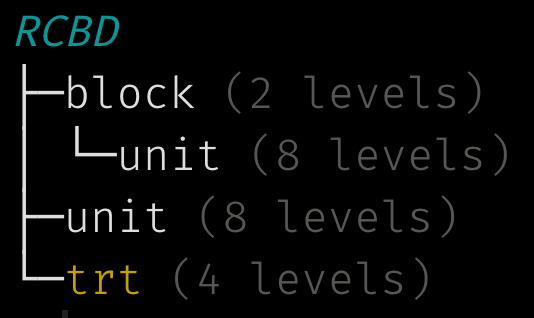
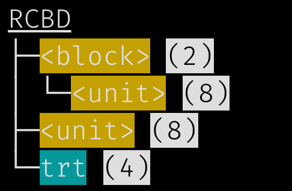

```{r, include = FALSE}
knitr::opts_chunk$set(
  collapse = TRUE,
  comment = "#>"
)
```

```{r save-options, include = FALSE}
old_opts <- options()
```

```{r setup}
library(edibble)
```

When you construct an experimental design, there are many intermediate steps along the way before you are ready to serve your design. edibble stores these intermediate constructs as an *edibble nexus* (`edbl_nexus`) which you can visualise in a number of ways. 

```{r}
set.seed(1231) 

new_rcbd <- function() {
  initiate_design(name = "RCBD") %>%
  set_units(block = c("B1", "B2"),
            unit = nested_in(block, 6)) %>%
  set_trts(trt = LETTERS[1:4]) %>%
  allocate_trts(~unit) %>%
  randomise_trts()
}

rcbd <- new_rcbd()

class(rcbd)
```


## Print for `edbl_nexus`

If you print an `edbl_nexus` object, it will show you a tree structure with a high-level overview of the design. Below is a print out of a design. The output form isn't really made for HTML and for complex reason color is lost for HTML (for the same reason as tibble).

```{r}
rcbd
```

The print out in terminal will look like below depending on your IDE theme (I'm using Tomorrow Night Bright theme in RStudio). You can see that the color of the nodes are dependant on which type of variable it is and also shows you how many levels each variable has.

```{r output1, echo = FALSE, out.width = "150px"}

```

### Formatting print for `edbl_nexus`

If you don't like the default choices, then you can easily customise the look by specifying the function of how to decorate the strings to options. Below I'm making use of functions in the cli package which wraps the string around in some styling.  

```{r opt1, eval = FALSE}
options(edibble.tree.decorate.trts = cli::bg_cyan,
        edibble.tree.decorate.units = function(x) cli::bg_yellow(glue::glue("<{x}>")),
        edibble.tree.decorate.resp = cli::col_yellow,
        edibble.tree.decorate.levels = function(x) cli::style_inverse(glue::glue("({x})")),
        edibble.tree.decorate.main = cli::style_underline)
```

Now the print out will look like below.

```{r opt1-print, eval = FALSE}
rcbd
```

```{r output2, echo = FALSE, out.width = "150px"}

```

Instead of overwriting the options each time, you can set your `.Rprofile` so that when you load R, it will load the options in your profile. You can easily open `.Rprofile` with `usethis::edit_r_profile()`. I normally don't recommend to do this as it makes your output non-reproducible by others but the print output is made more for interactive use rather than reports so it doesn't matter much in this case. 

## Plot for `edbl_nexus`

There are two views available for `edbl_nexus`: high-level view and low-level view. The high-level view is designed for the user to see the overview of variable relations. [ADD link to other document with more explanation.]

```{r rcbd-high-plot, fig.width = 4, fig.height = 4}
plot(rcbd)
```

There is also a low-level view of this.

```{r rcbd-low-plot, fig.width = 6, fig.height = 6}
plot(rcbd, view = "low")
```

### Formatting plot output for `edbl_nexus`

If you don't like these aspects, you can in fact overwrite this. There are two ways you can do this. 

1. `edbl_nexus` is just an `igraph` under the hood and it's leveraging the `plot` method there which means you can customise it the way it is done for `igraph`,
2. Modify the `options` output. You can see the full list of available options by printing `edibble:::op.edibble` with a few shown below.

```{r opt-plot}
options(edibble.vertex.shape.trt = "circle",
        edibble.edge.width.t2v = 3,
        edibble.vertex.fill.trt = "black")
```

This option is only applied to newly constructed designs so let's reconstruct the same design.

```{r  rcbd-high-plot-v2, fig.width = 4, fig.height = 4}
rcbd2 <- new_rcbd()
plot(rcbd2)
```

## Print for `edbl_df`

[ADD explanation]

```{r redefine}
serve_table(new_rcbd())
```

```{r opt3}
options(edibble.levels.label.leading_zero = TRUE)
serve_table(new_rcbd())
```

```{r opt4}
options(edibble.levels.label.leading_zero = TRUE,
        edibble.levels.label.min_ndigits = 5)
serve_table(new_rcbd())
```

```{r restore-options, include = FALSE}
options(old_opts)
```
