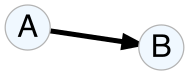
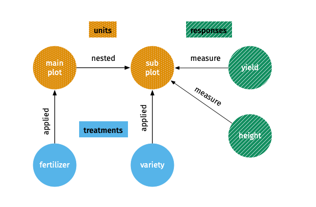
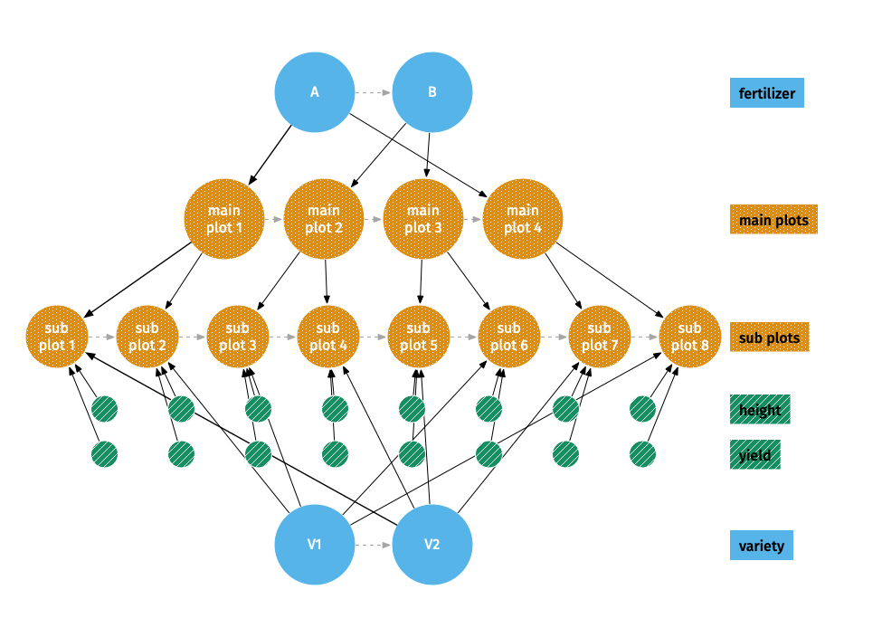
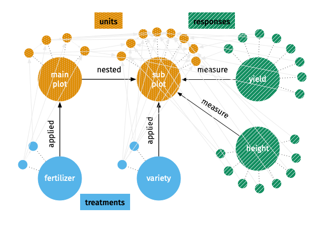
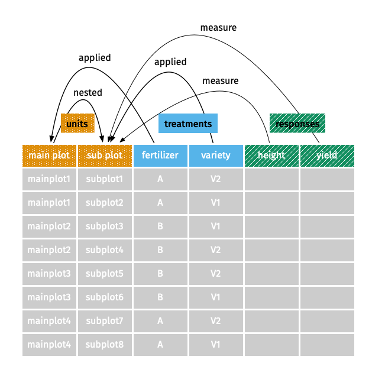

```{r, include = FALSE}
knitr::opts_chunk$set(
  collapse = TRUE,
  comment = "#>",
  out.width = "80%",
  fig.align = "center",
  fig.path = "figures/vignette-"
)
```

```{r AtoB, out.width = "50%", eval = FALSE, include = FALSE}
# this is used to create a graph
library(DiagrammeR)
library(here)
# can't figure out how to change background color
# change background color to "transparent" or "#f7f7f7"
create_graph() %>%
  add_node(label = "A", node_aes = node_aes(fontsize = 25, fontcolor = "black")) %>%
  add_node(label = "B", node_aes = node_aes(fontsize = 25, fontcolor = "black")) %>%
  add_edge(from = 1, to = 2, edge_aes = edge_aes(penwidth = 4, arrowsize = 1.2, color = "black")) %>% 
  export_graph(file_name = here("vignettes/figures/vignette-AtoB.svg"))
```

[WIP]

If you are looking to get started with _code_, look at `vignette("edibble")` instead. This vignette is a bit wordy and at times serves as the dumping ground of my own thoughts. 

In this vignette, I introduce terms that refer to special objects and concepts in edibble as an attempt to deconstruct an experimental design to its bare components. I can't say it has been an easy (let alone successful) attempt when the world of experimental design is so vast that sometimes such an attempt felt too ambitious and difficult, if not impossible, for me. Nonetheless, I gave it a try from the little knowledge I have on experimental design that stem mostly from working with plant breeding experiments and equally little skill I have in software development. Consequently, you might find (and rightly so) edibble subpar on many fronts compared to its grand goal. edibble will evolve, and hopefully also expand, as I come to understand better both the world of experimental design and the world of software development.

In edibble, the objects are governed by their respective structures and rules. The government isn't strict yet so there isn't much check put in place so you probably can get away with violations of the structures and rules. If I can think better, some of these may be converted to `R6` class (in fact edibble graph was using `R6` before I decided that `igraph` might be better!). This just means that there's some drastic evolution that might happen. The code itself has already undergone a number of major structural changes before I finally decided to release it publicly.   

The key objects are summarised in the table below with more details under their respective sections. For some objects, further details can be found in the help documentation of functions given under the documentation column in the table below.

object | class | purpose | documentation
:---|:---|:---|:---
edibble variable | `edbl_var` | a variable pertaining to the experimental design | `?set_vars`
edibble unit | `edbl_unit` | any entity, except treatment factors, that pertains to the experiment | `?set_units`
edibble treatment | `edbl_trt` | treatment factor in the experiment such that the factorial combination describes the whole treatment levels | `?set_trts`
edibble response | `edbl_resp` | the intended response to be measured during the experiment | `?measure_resp`
edibble graph | `edbl_graph` | an intermediate construct of the experimental design | this vignette
edibble table/data frame | `edbl_table` | a tibble output for experimental design | this vignette
replicabble | `rpbl_df` | a tibble that contains replication for treatment levels | `?replicabble`
linkabble | `lkbl_graph` or `lkbl_df` | a transitional component storing information about how levels across variables are linked | none

## An edibble variable

An edibble variable is any variable that is relevant in any aspect of the experiment (not just the design of experiment). An edibble variable can be physical (e.g. person, plot, animal and drug),  metaphysical (e.g. gender, time and space) or intended response measures.

There are three main types of edibble variable: an edibble unit (`edbl_unit`), an edibble treatment factor (`edbl_trt`), and an edibble response (`edbl_resp`). 

Currently, variables are limited to categorical variables.  

Every edibble variable comes in two forms: 

* a **vertex form** which contains:
   * `name`: variable name,
   * `class`: `"edbl_unit"`, `"edbl_trt"`, or `"edbl_resp"`, 
   * `vtype`: `"var"`, 
   * graphical attributes like `label`, and
   * connected to child level nodes which contain:
      * `name`: level name,
      * `label`: the level name,
      * `vtype`: `"level"`, and
      * graphical attributes like `label`.

* a **vector form** which is an integer vector which has classes `edbl_var`, `factor` and `vctrs_vctr` with attributes:
  * `name`: variable name, 
  * `class`: a character vector containing `"edbl_var"`, `"factor"`, and `"vctrs_vctr"`, and 
  * `levels`: a character vector of the level names.

The vector format behaves much like a `factor` except that the output is modified to include the number of levels in tibble output.

### An edibble unit

You can find more specific information in the documentation for `?set_units`.


### An edibble treatment factor

You can find more specific information in the documentation for `?set_trts`.

### An edibble response

You can find more specific information in the documentation for `?measure_resp`.

## An edibble graph

An edibble graph, or `edbl_graph` object, is a special type of directed graph made by `igraph`. This form is used to represent intermediate constructs of the experimental design. There are two views to this object: a _high-level view_ and a _low-level view_. 

In a **_high-level view_**:

* a vertex is a variable,
* an edge is a high-level connection between two variables, and
* the direction of an edge defines a relationship based on which two variables it is connecting. Say if we have two nodes named A and B with a directed edge starting from A to B, then the meaning of the relationship follows the table below. If the combination is not listed below then the nodes cannot have a direct relationship.


 A | B |  relationship
:--- |:--- |:---
unit | unit | B is nested in A
treatment | unit | B is applied to A
response | unit | B is measured on A

As an example, consider a split-plot design that contains 4 main plots with 2 sub plots within each main plot (so 8 subplots in total). There are 2 treatment factors: fertilizer (with levels A and B) and variety (with levels V1 and V2). Each level of the fertilizer is randomly applied to two main plots. Each level of variety is randomly applied to one sub plot within each main plot. Two responses are planned to be measured on the sub plots: yield and height.

A high-level view of the design from the above example is shown below.
```{r, echo = FALSE}

```

In a **_low-level view_**:

* a vertex is a level,
* an edge is a direct connection between two levels, and
* the direction of an edge defines the same relationship as for high-level view, except if the edge is connecting nodes of levels of the same unit variable then it represents the sequence order of the levels.

A low-level view of the split-plot design is shown below.

```{r, echo = FALSE}

```

The whole edibble graph object contains all the nodes and edges from the high- and low-level views. The whole edibble graph can have numerous nodes and edges, even when the number of units are small, that it's visualisation will be too cluttered to be any useful. Consequently, when visualising these intermediate construct of the experimental design, only a high- or low-level view is visible to the user, but the object contains the information seen in both views. 

Some information in the edibble graph object is illustrated below. There are edges that connect levels across variables, as well as sequenetial path for the order of the levels, but you may need to squint to see the lines.  

```{r, echo = FALSE}

```

## An edibble table (or data frame)

An edibble, or `edbl_table` object, is a special class of [`tibble`](https://tibble.tidyverse.org/). The word "edibble"
itself already implies that it is a table so appending the word with table or data frame seems superfluous. However, edibble can refer to the package, object, or used as an adjective to other objects, so appending edibble with table or data frame is to make explicit emphasis it refers to the `edbl_table` object, otherwise the reader is expected to infer its meaning by context.

An edibble data frame is produced when the variables can be laid out in a [tidy data](https://www.jstatsoft.org/article/view/v059i10) format. An edibble is constructed from two possible ways: 

(1) converting edibble graph to edibble using `serve_table` and 
(2) converting existing data frame to edibble using `edibble`. 

We say that an edibble graph is **reconcilable** if it can be converted to an edibble data frame with at least one row. The cell contents can be only filled out if every level in a variable can be matched to a level of another variable, otherwise it is not possible to complete a row.


```{r, echo = FALSE}

```


## Mathematically


Let $G$ be a graph produced as edibble graph with a vertex set $V(G)$, an edge set $E(G)$ and a relation that associates with each edge two vertices. By definition of an edibble graph, $G$ has the following properties:

* $|V(G)| = p + \sum_{i=1}^{p}m_i$ nodes where 
  * $p$ is the number of variables and 
  * $m_i$ is the number of levels for the $i$-th variable; and 
* $|E(G)| \geq \sum_{i=1}^p 2m_i$ since every level node is connected to its variable node and level nodes of the same variable are connected sequentially.

An edibble graph $G$ is reconcilable if every variable $v_A \in V(G)$ is connected to at least one other variable $v_B \in V(G), v_A\neq v_B$; every pair of variables $v_A \in G$ and $v_B  \in G$ in the with edge from $v_Av_B$............

